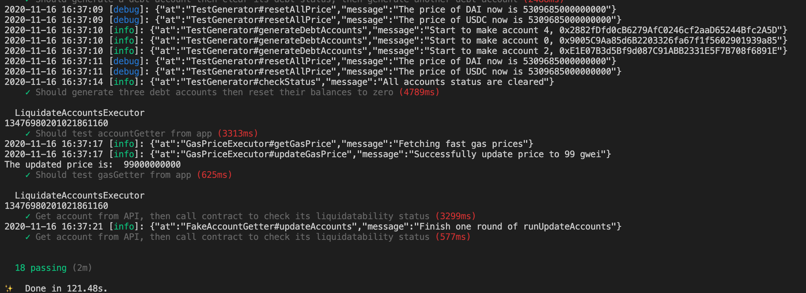

# Liquidator Bot
## Overview
This is a liquidator bot for DeFiner. Anyone can use this liquidator bot to automatically liquidate accounts who's debtValue/collateralValue exceeds a certain value. A user can specify what kind of tokens it wants to spend to liquidate other accounts, then the liquidation process will spend that kind of token to repay others debt in the same token, and buy the collateral of the target account at a discount.
### Why Use Liquidtor Bot
Every user can borrow an amount of tokens regarding its collateral value and initial LTV for each token.
 
)
 
A user can keep borrowing as long as:
 

 

But the tokens' prices are fluctuating, when the borrowed token's prices become too high, we may have this condition in borrower:
 

 
And if the borrowed token's price keeps rising, it may be:
 

 
So this account is at high risk of not repaying its debt, we allow any one to liquidate this account. As for incentive, the liquidator will be able to buy target account's collateral **at a discount of 5% off**.
### Example
Assume USDT and DAI are both of price 1.
- Before liquidation:
  - User1:
    - Deposits: 100 USDT
    - Loans: 90 DAI
    - LTV: 0.9, liquidatable
  - User2:
    - Deposits: 100 DAI
  
User2 tries to liquidate user1.
- After liquidation:
  - User1:
    - Deposits: 100 - 85.7 = 14.3 USDT
    - Loans: 90 - 85.7*0.95 = 8.6 DAI
    - LTV: 0.6, not liquidatable
  - User2:
    - Deposits: 18.6 DAI, 85.7 USDT

## Useage
### Requirement
- Nodejs: https://nodejs.org/en/
- An account that has deposited some **target token** in DeFiner, and it has enough ETH to call liqudiate() function.
- Typescript: https://www.typescriptlang.org/download
- An access node: https://infura.io/
- Ensure that your account has enough ETH for all the liquidation operation.

### Env Variables
You can create a `.env` file and take the template of `.env.example` to make your customized settings. If some fields are not specified, it will adopt the default values.
| Name                                 | Description                                            | Default Value                                 |
| ------------------------------------ | ------------------------------------------------------ | --------------------------------------------- |
| GAS_STATION_URL                      | URL to use api to get the newest gas price             | http://ethgasstation.info/json/ethgasAPI.json |
| GAS_PRICE_UPDATE_FREQUENCY_MILLI_SEC | How frequently to update the gas in milliseconds       | 5000                                          |
| GAS_INITIAL_PRICE                    | Initial gas price in gwei                              | 25                                            |
| GAS_PRICE_MULTIPLIER                 | The mutilplier for gas price.                          | 1                                             |
| LIQUIDATE_INTERVAL_MILLI_SEC         | How much time do we wait after one liquidation round   | 10000                                         |
| LIQUIDATOR_TOKEN                     | What token liquidator use to liquidate other accounts. | ETH                                           |
| PROVIDER_TYPE                        | Provider type, privatekey or mnemonic                  | privatekey                                    |
| PRIVATE_KEY                          | Should specify if use privatekey provider              | NULL                                          |
| PUBLIC_KEY                           | The public key that the user trying to use             | NULL                                          |
| USER_MNEMONIC                        | Should specify if use mnemonic provider                | NULL                                          |
| ACCESS_NODE_URL                      | Your access node's URL                                 | NULL                                          |
| ACCOUNT_NUM                          | How many accounts to get for one round                 | 1000                                          |

### Run from Docker
- Require install [docker](https://docs.docker.com/get-docker/)
- Run: `docker run \
  -e ACCESS_NODE_URL=YourAccessNode \
  -e PRIVATE_KEY=YourPrivateKey \
  -e PUBLIC_KEY=YourPublicKey \
  dongyongguaige/liquidator-bot:first-version`

### Build from Source
- Download this git repo: `git clone https://github.com/DeFinerOrg/Savings.git`
- Install dependencies: `npm i`
- Go inside this directory: `cd liquidator-bot/`
- Create a file called .env in the root directory. You can check the last section on instructions about how to create that file.
- Run the liquidator bot: `ACCESS_NODE_URL=YourAccessNode PRIVATE_KEY=YourPrivateKey PUBLIC_KEY=YourPublicKey ts-node src/index.ts`
- You can find logs inside: `logs/` directory

## Test
### Overview
I have tests for each module of the system, but run some tests will be little difficult. It will require you to deploy DeFiner's protocol locally first, which is not open sourced yet. Here I have this screenshot of successfully run all the tests.
